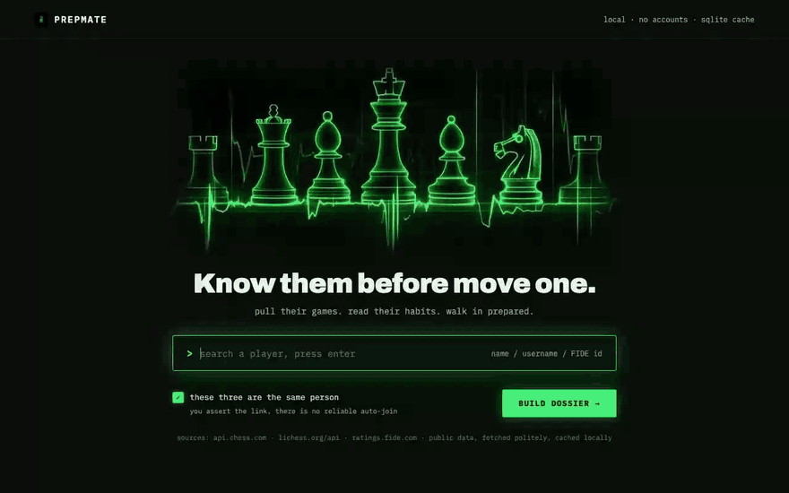
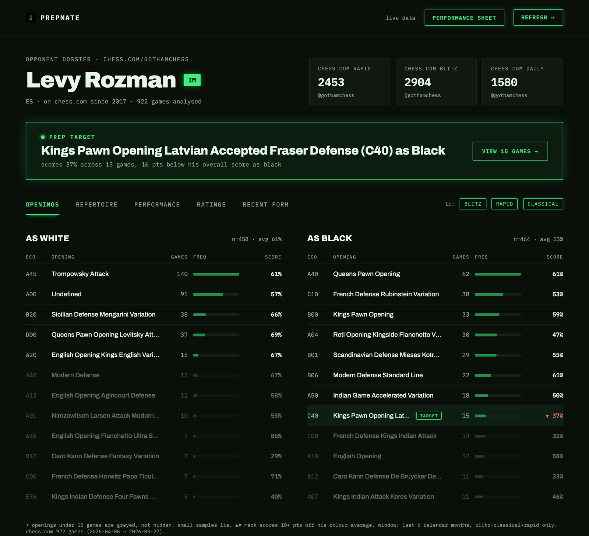
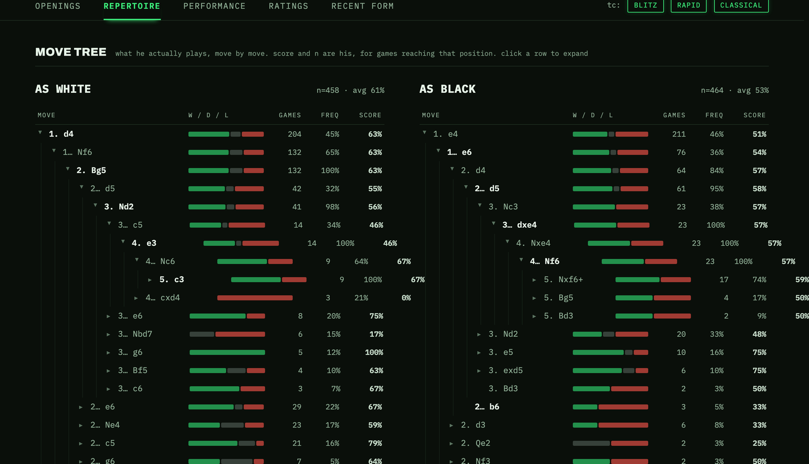
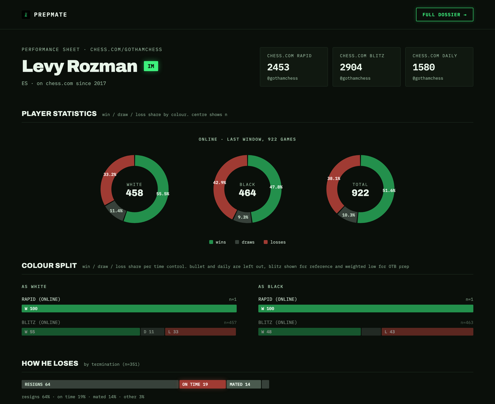
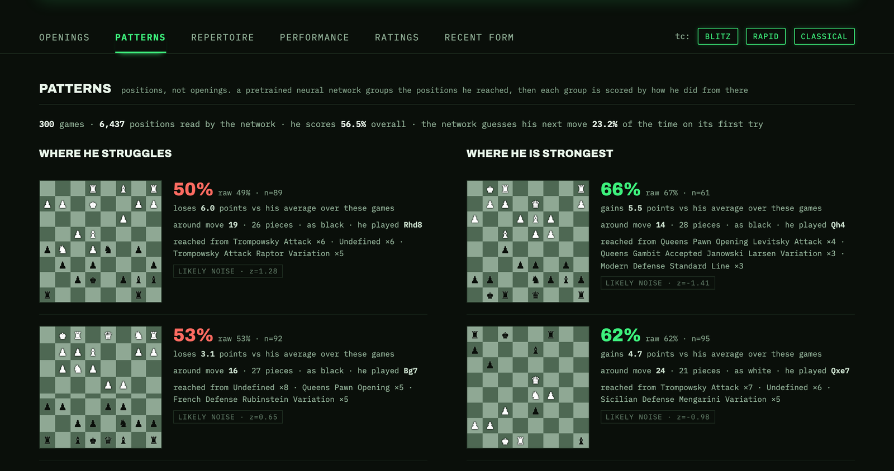

# PrepMate

I built PrepMate to get ready for chess tournaments. Before a round I want to know what my opponent plays and where they tend to go wrong. Now I type their name, and PrepMate builds a scouting report from their public games on chess.com and lichess, plus their FIDE profile.

**Try it at [prepmate-chess.fly.dev](https://prepmate-chess.fly.dev)**

<p align="center">
  <a href="docs/images/demo.mp4"></a>
</p>

## What a report looks like

The screenshots here use Levy Rozman (GothamChess). His games are public and there are plenty of them, which makes him a good test.



The box at the top is the prep target. PrepMate looks for openings where the player has at least 15 games and scores 10 or more points below their own average with that colour. If there are several, it picks the one they play most, since that's the one I'm most likely to face. For Levy it lands on the Latvian Gambit as Black, where he scores 37% across 15 games. That's 16 points under his usual result with Black.

Under it are his openings for each colour, how often he plays them, and how he scores. Anything under 15 games is greyed out rather than hidden, because a few games can make anyone look good or bad at anything. Every panel follows the time control filter. Blitz, rapid, and classical are on by default. I leave bullet and daily out, since they say little about how someone plays over the board.



The repertoire tab turns the same games into a move tree. I can follow a line one move at a time and see where his results start to drop. It covers the first twelve plies and prunes anything seen fewer than twice.



The performance sheet puts the rest on one page. It shows his results by colour and by time control, how his losses end, and his last 20 games.

## Looking past the opening

Opening tables group games by ECO code, which names a move order and stops around move ten. Two games can reach the same pawn structure through different openings and get filed apart, and a weakness that only appears in the middlegame never shows up at all.

So I wrote a second engine in `backend/patterns` that works on positions instead of names. It replays every game, picks out the moments where the player had a real choice, and runs each position through a small convolutional network to turn it into a vector. Then it clusters those vectors with spherical k-means and scores each cluster by how the player actually did from there. A cluster is a kind of position, not an opening, so transpositions end up together and the middlegame is finally covered.

The network is pretrained on other players' games and then frozen, and it never sees the opponent. A few hundred games is only a few hundred samples, and a model with real capacity would just memorise them. So the only work done per opponent is clustering and counting. I wrote up the reasoning and the measured costs in [docs/patterns.md](docs/patterns.md).

Here is a real run on Levy's games, trimmed to one row from each end.

```
$ python -m backend.patterns.scout --chesscom gothamchess --model models/pos-v1.pt
922 games, 76730 plies -> 21025 decisions -> 20326 positions (0 cached, 20326 encoded)
replay 2275ms, encode 5006ms, space cnn64x4d128-cf79a4ca

baseline score 56.8% over the analysed games

WEAKEST STRUCTURES
  score  52.5% (raw  52.3, n=326)  +14.27 pts vs par  z= 1.60
      around move 16, 26 men, French Defense Rubinstein Variation x33, Undefined x28, ...

STRONGEST STRUCTURES
  score  62.3% (raw  62.4, n=370)  -20.04 pts vs par  z=-2.10
      around move 7, 31 men, Undefined x38, Queens Pawn Opening Levitsky Attack x21, ...

z is a ranking aid, not a p-value: the clusters were chosen by looking
at the same games they are scored on, so treat anything under 2 as noise.
```

All 922 games went through in about seven seconds on my laptop. His weakest cluster sits around move 16 and comes out of several different openings, which is exactly what the ECO tables can't connect. He drops about 14 points there compared with his average. Still, its z is only 1.6, so for Levy the honest answer is that nothing stands out yet. I made the tool say that out loud instead of dressing up noise as a finding.

### On the website

Anyone can use it now, with nothing to install. Open a dossier and click the Patterns tab.



Each group shows one typical position on a board, with his pieces at the bottom, the move he played there, and how he scores from positions like it. Anything the numbers can't back up is marked as likely noise, same as on the command line. The tab also shows how often the network guesses his next move on its first try, which for Levy is 23%.

Getting it onto the site took some work. The site runs as a Vercel function, and every cold start loads the whole bundle, so Torch would add hundreds of megabytes to each one. The network is small, though, so I wrote its forward pass again in plain NumPy (`backend/patterns/npnet.py`). `train/export_numpy.py` folds each BatchNorm into the convolution in front of it and saves the weights to `backend/patterns/weights/pos-v1.npz`, and the site runs those with nothing but NumPy. On 2,000 random positions the two versions agreed to within 0.000003, and a test holds them to that. The site reads a player's most recent 300 games, runs one scout at a time per instance, and serves repeat visits from the cache while the instance stays warm.

### From the command line

The quickest way is with the encoder I already trained, which is attached to the [pos-v1 release](https://github.com/danish-puri/prepmate/releases/tag/pos-v1).

```sh
python -m pip install -r requirements-patterns.txt
mkdir -p models
curl -L -o models/pos-v1.pt https://github.com/danish-puri/prepmate/releases/download/pos-v1/pos-v1.pt
python -m backend.patterns.scout --lichess <username> --model models/pos-v1.pt
```

To train your own, fetch a corpus and pretrain on it first.

```sh
python -m train.pretrain fetch --users train/users.txt --per-user 200 --out data/corpus
python -m train.pretrain train --corpus data/corpus --out models/pos-v1.pt --device mps
```

Without `--model` it falls back to handcrafted features. That keeps the pipeline testable, but the trained network is the real thing. If you retrain, run `python -m train.export_numpy models/pos-v1.pt backend/patterns/weights/pos-v1.npz` so the website picks up the new weights.

## Running it

The web app is FastAPI with plain HTML, CSS, and JavaScript pages, and it caches what it fetches from the chess sites in SQLite. I use Python 3.14, the same version the site runs on.

```sh
python3 -m venv .venv
source .venv/bin/activate
python -m pip install -r requirements.txt
uvicorn backend.main:app --host 127.0.0.1 --port 8000
```

Then open http://localhost:8000. Lookups need internet access, since the data comes live from the chess sites.

## Tests

```sh
python -m pip install -r requirements-dev.txt
python -m pytest -q
```

The suite stubs every outside API, so it runs offline and never touches a real account. It covers the analysis, the adapters, the cache, every endpoint, the filters, the rate limits, the pages, the pattern pipeline, and the NumPy network against reference outputs from the Torch model. The Torch tests run once `requirements-patterns.txt` is installed and are skipped otherwise.

## Settings

Everything is optional and read from the environment at startup.

| Variable | What it does | Default |
| --- | --- | --- |
| `CACHE_DB` | Where the SQLite cache lives | `/tmp` on Vercel, `backend/cache.db` elsewhere |
| `ALLOWED_ORIGINS` | Comma-separated CORS origins, or empty for none | local origins |
| `RATE_LIMIT_PER_MINUTE` | API requests per minute per IP | `60` |
| `RATE_LIMIT_BURST` | API requests allowed back to back | `20` |
| `STATIC_RATE_LIMIT_PER_MINUTE` | Page requests per minute per IP | `60` |
| `STATIC_RATE_LIMIT_BURST` | Page requests allowed back to back | `30` |
| `CLIENT_IP_HEADER` | Header with the real client IP behind a proxy | `x-real-ip` on Vercel, unset elsewhere |

Every API call fans out to chess.com and lichess under PrepMate's User-Agent. The rate limit is there so one impatient visitor can't cause trouble for them. `/healthz` is never limited.

## Deployment

The live site runs on Vercel, which builds it straight from this repository. Every push to `main` deploys, and every pull request gets its own preview link. Vercel finds the app through `app.py`, reads the Python version from `.python-version`, and installs `requirements.txt`. `vercel.json` keeps tests, docs, and training code out of the function.

Vercel has no permanent disk, so the SQLite cache lives in `/tmp` and resets when an instance goes cold. That means a first visit after a quiet spell downloads the games again. The Dockerfile still works on any host with a real disk, such as Railway through `railway.json` and `.env.railway.example`, which holds settings only, never credentials.

## Where things are

| Path | What's in it |
| --- | --- |
| `backend/` | The API, the chess.com, lichess, and FIDE adapters, the analysis, the cache, and the rate limiter |
| `backend/patterns/` | The position encoder, its NumPy weights for the website, clustering, and the command-line scout |
| `train/` | Pretraining the encoder on a public corpus |
| `static/` | The web pages |
| `tests/` | The offline test suite |
| `docs/` | Design notes and the images in this README |

## Where the data comes from

Games come from the public chess.com and lichess APIs. FIDE has no API, so that adapter reads the public profile page, and it can break if FIDE changes the page. FIDE gives ratings and profile details only, not games. Nothing in a report is estimated or made up. Every number comes from real games, and the sample size sits next to it.
